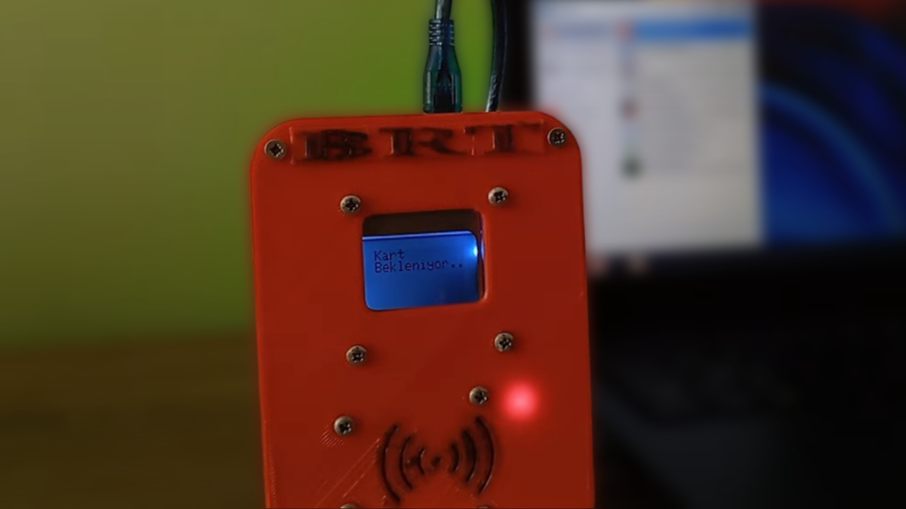

# Arduino ile Akbille Açılan Bilgisayar Projesi



## Arduino ile Akbille Açılan Bilgisayar Projesi
Arduino ve elektronik komponentleri bir araya getirerek, saçma bir proje yapıyoruz. Bu şeye akbil okuttuğumuzda bilgisayarın kilidini açıyor! 🎮✨

## Video

Proje hakkında daha fazla bilgi almak için aşağıdaki videoyu izleyebilirsiniz:
[YETERSİZ BAKİYE!](https://www.youtube.com/watch?v=VE0KbELtkhU)

## Malzeme Listesi

- [Arduino Leonardo]
- [5110 LCD Ekran]
- [RC522 RFID]
- [DFplayer]
- [Hoparlör]
- [Kablolar]

## 3D Modellerin İndirme Linkleri

- [Thingiverse](https://www.thingiverse.com/thing:2981973)

---

## Arduino Kodu

```cpp
/***************************************************************************
*                                                                          *
*       Arduino ile Akbille Açılan Bilgisayar Projesi                      *
*       Youtube: https://youtu.be/VE0KbELtkhU                               *
*                                                                          *
***************************************************************************/
#include <SPI.h>
#include <MFRC522.h>

#define RST_PIN         9
#define SS_PIN          10

MFRC522 mfrc522(SS_PIN, RST_PIN);

void setup() {
  Serial.begin(9600);
  SPI.begin();
  mfrc522.PCD_Init();
}

void loop() {
  if ( ! mfrc522.PICC_IsNewCardPresent()) {
    return;
  }

  if ( ! mfrc522.PICC_ReadCardSerial()) {
    return;
  }

  Serial.println("Akbil okundu, bilgisayar açıldı!");
}
